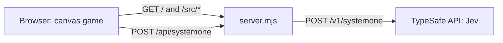

# Jong

Pong in the browser, played against an AI opponent driven
by [TypeSafe AI](https://docs.typesafe.ai/models)'s Jev
model. A match is best of 3 rounds: the first player to win
2 rounds wins. Everything runs in the browser on a single
HTML canvas. The only server is a tiny local proxy.

## Features

- **Jev as your opponent** — the AI paddle is steered by
  Jev's typed decisions, fetched live during play
- **Live latency** — Jev response times are shown in the
  game HUD
- **Canvas only** — no UI framework, no build step, no
  npm dependencies
- **Hit feedback** — the ball leaves a short fading trail,
  and a paddle recoils when it strikes the ball
- **Move your paddle** — W/S, the arrow keys or the mouse
  (just move it, no button needed); the latest input wins,
  so an arrow key takes over from the mouse until the
  mouse moves again. The mouse cursor hides while the ball
  is in play, and the paddle stays put when the cursor
  leaves the window
- **Mobile-friendly** — the 800x400 court scales down to
  fit smaller screens, with touch controls: drag a finger
  anywhere on the screen to move your paddle; the game
  pauses automatically when you leave the page (switch
  app, lock the screen)
- **Your key stays in memory** — the TypeSafe API key you
  enter is never stored

## Prerequisites

- [Node.js](https://nodejs.org/) 24.2 or later
- `make`
- [Docker](https://www.docker.com/), only for the image
  targets (`make image`, `make image-run`)
- A TypeSafe AI API key, entered in the game when you play

## Getting Started

From a clone of this repository, start the local server:

```bash
make dev
```

Open the printed URL (`http://localhost:3000/` by
default). The server also prints a `Network` URL: open it
on a phone connected to the same Wi-Fi to play on mobile.

`make dev` restarts the server when its code changes;
reload the page to pick up client-side changes.

## Usage

Run `make` to list every available target:

```bash
make dev        # run the server, restarting on change
make app-up     # run the server without watching
make test       # run the test suite (node --test)
make check      # run tests and syntax checks
make image      # build the container image
make image-run  # build and run the container image
```

## Configuration

| Variable           | Description                      | Default                                |
| ------------------ | -------------------------------- | -------------------------------------- |
| `PORT`             | Port the local server listens on | `3000`                                 |
| `TYPESAFE_API_URL` | Upstream URL for Jev requests    | `https://api.typesafe.ai/v1/systemone` |

## Docker Image

Every push to `main` publishes a multi-arch image
(`linux/amd64` and `linux/arm64`) to the GitHub Container
Registry. Run it and open `http://localhost:3000/`:

```bash
docker run --rm -p 3000:3000 ghcr.io/alexandreroman/jong
```

The image is tagged `latest` and `sha-<commit SHA>`. It
runs as a non-root user, reads the same `PORT` and
`TYPESAFE_API_URL` variables as the local server, and
declares a health check on `/`.

## Continuous Integration

The `.github/workflows/docker.yml` workflow runs on every
push and pull request to `main`:

1. **Test** — runs `make check` on Node.js 24
2. **Build** — builds the image natively on `amd64` and
   `arm64` runners, with layers cached in GitHub Actions
3. **Publish** — on `main` only, pushes both platform
   images and merges them into one multi-arch manifest

Pull requests build the image without publishing it.

## How Jev Plays

The game keeps exactly one Jev request in flight and sends
the next one as soon as the answer arrives. Each request
carries the ball position and velocity, both paddles and,
while the ball comes toward Jev, two hints: the time in
seconds until the ball reaches Jev's paddle
(`timeToReachYou`) and the number of top/bottom wall
bounces before then (`wallBounces`). Jev still has to work
out where the ball lands from these hints.

Each request asks two `choice` questions:

- **`target`** — which of ten 40 px zones (`y0-40` to
  `y360-400`, top to bottom) the ball reaches the paddle
  in; the paddle aims at the zone center
- **`aim`** — `up`, `straight` or `down`: where to send
  the ball back, away from the human paddle

The game then shifts the paddle 15 px from the zone center
so the ball hits the side that deflects it in the chosen
direction, while leaving slack within the hit tolerance for
rounding and imperfect estimates. In the edge zones
(`y0-40` and `y360-400`), the paddle cannot move its center
past y 40 or y 360, so the requested direction may not be
reachable. While the ball moves away, the paddle goes back
to the middle of the court, whatever Jev answers.

## Architecture

The TypeSafe API rejects cross-origin requests from
browsers, so `server.mjs` serves the game and relays Jev
calls from the same origin. It forwards only the request
body and the `Authorization` header, and holds no game
logic.



| Path         | Description                                   |
| ------------ | --------------------------------------------- |
| `index.html` | Page hosting the game canvas                  |
| `src/`       | Browser game code (ES modules)                |
| `server.mjs` | Static file server and TypeSafe proxy         |
| `test/`      | Tests run with the built-in `node --test`     |
| `Dockerfile` | Container image for the server and game files |
| `.github/`   | CI workflow: tests, multi-arch image publish  |

## License

This project is licensed under the Apache-2.0 License —
see [LICENSE](LICENSE) for details.
