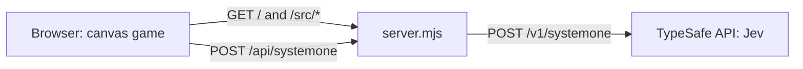

# Jong

Pong in the browser, played against an AI opponent driven
by [TypeSafe AI](https://docs.typesafe.ai/models)'s Jev
model. A match lasts 3 rounds, and everything runs in the
browser on a single HTML canvas. The only server is a tiny
local proxy.

> **Status:** early development. The server, proxy and
> responsive canvas are in place; gameplay is in progress.

## Features

- **Jev as your opponent** — the AI paddle is steered by
  Jev's typed decisions, fetched live during play
- **Live latency** — Jev response times are shown in the
  game HUD
- **Canvas only** — no UI framework, no build step, no
  npm dependencies
- **Mobile-friendly** — the 800x400 court scales down to
  fit smaller screens, with touch controls
- **Your key stays in memory** — the TypeSafe API key you
  enter is never stored

## Prerequisites

- [Node.js](https://nodejs.org/) 24 or later
- A TypeSafe AI API key, entered in the game when you play

## Getting Started

From a clone of this repository, start the local server:

```bash
make dev
```

Open the printed URL (`http://localhost:3000/` by
default). The server also prints a `Network` URL: open it
on a phone connected to the same Wi-Fi to play on mobile.

`make dev` restarts the server when its code changes;
reload the page to pick up client-side changes.

## Usage

Run `make` to list every available target:

```bash
make dev     # run the server, restarting on change
make app-up  # run the server without watching
make test    # run the test suite (node --test)
make check   # run tests and syntax checks
```

## Configuration

| Variable           | Description                   | Default                                 |
| ------------------ | ----------------------------- | --------------------------------------- |
| `PORT`             | Port the local server listens | `3000`                                  |
| `TYPESAFE_API_URL` | Upstream URL for Jev requests | `https://api.typesafe.ai/v1/systemone`  |

## Architecture

The TypeSafe API rejects cross-origin requests from
browsers, so `server.mjs` serves the game and relays Jev
calls from the same origin. It forwards only the request
body and the `Authorization` header, and holds no game
logic.



| Path          | Description                                    |
| ------------- | ---------------------------------------------- |
| `index.html`  | Page hosting the game canvas                   |
| `src/`        | Browser game code (ES modules)                 |
| `server.mjs`  | Static file server and TypeSafe proxy          |
| `test/`       | Tests run with the built-in `node --test`      |

## License

This project is licensed under the Apache-2.0 License —
see [LICENSE](LICENSE) for details.
